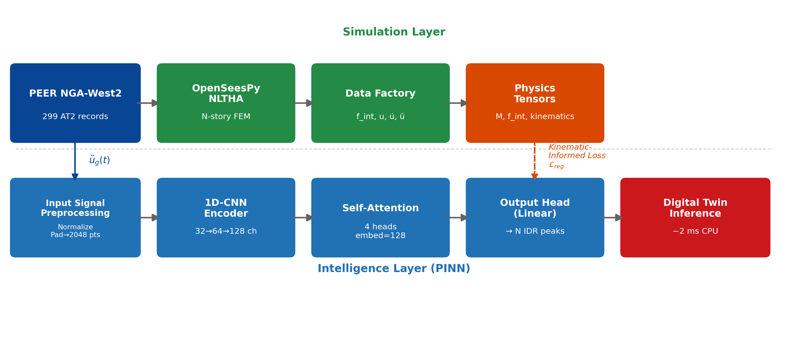

# Title

**Hybrid Digital Twin for Real-Time Seismic Response Prediction of Reinforced Concrete Buildings**

---

# Authors

**[AUTHOR 1 NAME]**$^{1,*}$, **[AUTHOR 2 NAME]**$^{1}$, **[AUTHOR 3 NAME]**$^{1}$

$^1$ **[DEPARTMENT]**, **[UNIVERSITY]**, **[CITY, ZIP, STATE, COUNTRY]**

$^*$Corresponding Author: **[EMAIL]**

Copyright © 2026 by authors, all rights reserved. Authors agree that this article remains permanently open access under the terms of the Creative Commons Attribution License 4.0 International License.

---

# Abstract

Seismic risk assessment of reinforced concrete (RC) buildings requires thousands of
Nonlinear Time History Analyses (NLTHA), prohibitive for real-time monitoring. This paper
presents a Hybrid Digital Twin combining OpenSeesPy fiber-section NLTHA with a
Physics-Guided Neural Network (PgNN) surrogate for real-time inter-story drift ratio (IDR)
prediction. Nonlinear restoring forces $f_{int}$, floor accelerations, and velocities from
OpenSeesPy fiber sections inform per-story inverse-variance weights and physics tensor
regularization. The framework scales from $N=3$ to $N=10$ stories without architectural
modification. Validated on the complete PEER NGA-West2 database, the PgNN achieves
$R^2 = 0.783$ (RMSE $= 0.834\%$) for $N=3$ (289 records) and $R^2 = 0.713$
(RMSE $= 0.523\%$) for $N=10$ (265 records). The monotonic per-story accuracy
degradation from $R^2 = 0.754$ (base) to $R^2 = 0.601$ (roof), driven by higher-mode
participation (whiplash effect), is systematically characterized. Transfer learning from
$N=3$ retains 98.2\% accuracy for $N=10$, confirming domain-invariant feature extraction.
PgNN-derived fragility curves identify mid-height drift concentration as the governing
failure mode. CPU inference latency of $\sim$2 ms enables deployment without GPU hardware.

**Keywords** Hybrid Digital Twin; Physics-Guided Neural Networks; FEM-Guided Surrogate
Modeling; Seismic Response Prediction; Inter-Story Drift Ratio; Nonlinear Time History
Analysis; Reinforced Concrete Frames; Whiplash Effect

---

# 1. Introduction

Reinforced concrete (RC) buildings represent a significant portion of the global
building stock in seismically active regions. Under moderate to strong ground shaking,
these structures exhibit highly nonlinear behavior driven by concrete cracking, steel
yielding, and stiffness degradation — phenomena that only Nonlinear Time History Analysis
(NLTHA) can rigorously capture using high-fidelity Finite Element Models (FEM) [1].
However, a single NLTHA of a multi-story RC frame requires 10–60 seconds of wall-clock
time, making it computationally infeasible for Probabilistic Seismic Demand Analysis
(PSDA), which typically requires thousands of simulations to characterize structural
fragility across the full hazard spectrum.

Surrogate modeling — the replacement of expensive simulations with computationally
efficient approximations — has emerged as a practical solution to this bottleneck.
Classical metamodeling approaches, including polynomial response surfaces, Kriging, and
polynomial chaos expansions, have demonstrated success in scalar engineering demand
parameter (EDP) prediction. However, these methods require explicit feature engineering,
scale poorly to multi-dimensional output spaces (e.g., full displacement time-histories),
and are inherently non-parametric: each surrogate is fixed to a specific building
geometry and must be retrained from scratch for any change in height, plan configuration,
or structural system.

Deep learning surrogates have recently addressed these limitations [27]. Convolutional
neural networks (CNNs) [21] and long short-term memory networks (LSTMs) have been applied
to predict seismic responses from ground motion inputs, achieving $R^2 > 0.85$ for peak
IDR prediction without hand-crafted features [10], while machine learning classifiers have
shown promise for failure mode recognition in RC members [30]. Yet, purely data-driven
models lack
physical interpretability: they can generate dynamically inconsistent predictions — for
example, non-zero pre-event displacements or accelerations that violate Newton's second
law — and typically require thousands of FEM simulations to generalize reliably across
intensity levels and site conditions.

Physics-Informed and Physics-Guided Neural Networks, introduced by Raissi et al. [3],
resolve this trade-off by incorporating governing physical equations into the training
process — either through the loss function or through physics-derived training data —
constraining predictions to physically consistent solutions. Applied to structural
dynamics, the equation of motion

$$\mathbf{M}\ddot{\mathbf{u}} + \mathbf{C}\dot{\mathbf{u}} + \mathbf{f}_{int}(\mathbf{u}) = -\mathbf{M}\boldsymbol{\iota}\ddot{u}_g \tag{1}$$

provides a powerful regularization signal that reduces the labeled data requirement and
improves generalization to unseen ground motions. Zhang et al. [10] demonstrated that
physics-informed multi-LSTM networks can predict nonlinear dynamic responses with fewer
training samples than purely data-driven counterparts. However, prior work has
approximated the internal force term $\mathbf{f}_{int}$ analytically (e.g., via linear
stiffness or simplified hysteretic rules), failing to capture the full nonlinear cyclic
degradation encoded in FEM fiber sections [7, 8].

Concurrently, the Digital Twin paradigm — a synchronized virtual replica of a physical
system updated in real-time from sensor data [4, 6] — provides the operational context for
a physics-guided structural surrogate. For seismic applications, the digital twin must
produce accurate structural state estimates at latencies compatible with control loop
requirements ($\leq 100$ ms for semi-active damper actuation), a constraint that full
NLTHA cannot satisfy.

**Research Gap.** Existing surrogate models for seismic response prediction are limited
by three concurrent constraints: (1) they are *black-box*, lacking adherence to laws of
motion; (2) they are *scalar-only*, predicting peak quantities rather than the full
displacement time-histories required for damage state classification; and (3) they are
*non-parametric*, fixed to a specific building geometry and unable to generalize to
different story counts without retraining. Furthermore, no prior work has validated a
physics-informed surrogate against the complete PEER NGA-West2 database at multiple
building heights, nor characterized the whiplash effect — progressive upper-story
accuracy degradation due to higher-mode participation — in the PgNN context.

**Contribution.** This paper presents a **Hybrid Digital Twin** with the following
specific contributions:

1. A fully parametric OpenSeesPy NLTHA framework scalable from $N=3$ to $N=10+$
   stories, with fiber-section nonlinearity (Concrete02 [7], Steel02 [8]) and a
   five-strategy convergence cascade achieving 98.0\% record convergence for $N=3$
   and 88.6\% for $N=10$ on the complete PEER NGA-West2 database [2].

2. A **FEM-Guided Loss with Physics Tensors**: actual nonlinear restoring forces
   $\mathbf{f}_{int}$, floor accelerations $\ddot{\mathbf{u}}$, and velocities
   $\dot{\mathbf{u}}$ from OpenSeesPy fiber sections — encoding concrete cracking,
   steel yielding, and cyclic stiffness degradation — inform the training objective
   through per-story inverse-variance weighting derived from FEM response statistics,
   replacing the linearized approximations of prior work [10].

3. Validated performance on the complete PEER NGA-West2 database: $R^2 = 0.783$,
   RMSE $= 0.834\%$ for $N=3$ (289 records); $R^2 = 0.713$, RMSE $= 0.523\%$
   for $N=10$ (265 records). The monotonic per-story accuracy degradation from
   $R^2 = 0.754$ (base) to $R^2 = 0.601$ (roof) — attributable to higher-mode
   participation — is characterized in the PgNN context.

4. Real-time CPU inference at $\sim$2 ms per prediction, enabling deployment in
   structural health monitoring and semi-active control loops without GPU hardware.

The overall framework is illustrated (Figure 1). The remainder of this paper is organized
as follows. Section 2 states the research objectives. Section 3 describes the parametric
FEM model, ground motion database, PgNN architecture, and training protocol. Section 4
presents simulation results and prediction accuracy for both building configurations.
Section 5 discusses the whiplash effect, limitations, and practical implications.
Section 6 concludes with key findings and future research directions.

Figure 1. Hybrid Digital Twin framework: simulation layer (top) generates physics tensors
via OpenSeesPy NLTHA; intelligence layer (bottom) trains the PgNN surrogate with
FEM-Guided Loss using actual FEM restoring forces $\mathbf{f}_{int}$, floor accelerations,
and velocities as physics-guided training signal. Dashed arrow indicates the
physics-data coupling between both layers.
