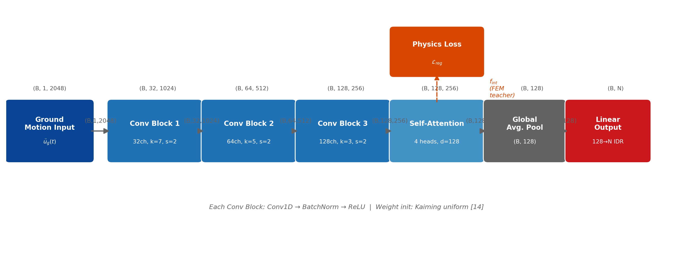

# 3. Materials and Methods

## 3.1 Structural Model

The reference dataset is generated using high-fidelity Nonlinear Time History
Analysis (NLTHA) implemented in OpenSeesPy [1, 19]. The structural system consists of
a parametric reinforced concrete (RC) plane frame with $N$ stories and 3 bays,
where $N$ is a runtime argument validated by the centralized configuration system
(Section 3.6). Two building heights were studied: a 3-story low-rise frame
($N=3$) for primary model validation, and a 10-story mid-rise frame ($N=10$) for
scalability assessment under higher-mode dominated seismic response.

### 3.1.1 Finite Element Implementation

Structural nonlinearity is modeled using **force-based beam-column elements**
(`forceBeamColumn`) with 5-point Gauss-Lobatto integration along the element
length — a formulation that avoids the localization issues inherent in
displacement-based elements and provides section-level plastic hinge resolution
without mesh refinement. Material nonlinearity is captured through
fiber-discretized cross-sections with the following constitutive assignments:

- **Confined concrete** (`Concrete02`): Mander's confinement model with
  $f'_{cc} = \kappa_c f'_c$ where $\kappa_c \approx 1.3$ for the interior
  confined core, transitioning to unconfined cover properties at the boundary
  fibers. Cyclic stiffness degradation and crack-closing stiffness are
  modeled via the linear tension stiffening parameter $\lambda$ [7].

- **Longitudinal reinforcement** (`Steel02`): Giuffré-Menegotto-Pinto model
  for smooth cyclic hardening with isotropic strain hardening ratio
  $b = 0.01$ and curvature parameters $R_0 = 18$, $cR_1 = 0.925$,
  $cR_2 = 0.15$ [8].

- **Mass**: Lumped at beam-column nodes as per seismic design standards
  (ACI 318-19 [5]), computed from tributary area and dead load assumptions.

**Rayleigh damping** is assigned with 5% critical damping at the first and
third modal periods, consistent with code-level design practice for RC frames.
P-Delta geometric nonlinearity is activated via the `PDelta` transformation.

### 3.1.2 Structural Configuration

For $N=3$: uniform column sections ($400 \times 400$ mm, $\rho_l = 2\%$),
story height 3.5 m (first story) and 3.0 m (upper stories), bay width 5.0 m.

For $N=10$: tapering column sections ($700 \times 700$ mm at grade $\to$
$500 \times 500$ mm at roof), with longitudinal reinforcement ratios decreasing
from $\rho_l = 2.5\%$ to $\rho_l = 1.5\%$ to simulate realistic design
practice for mid-rise RC buildings (Figure 2).

Figure 2. Parametric RC frame configurations: (a) 3-story uniform frame ($N=3$);
(b) 10-story frame with tapering sections ($N=10$) — orange band marks the
Floors 8–10 whiplash zone; (c) fiber section cross-section detail showing
unconfined cover (Concrete02), confined core (Mander confinement), and
longitudinal reinforcement (Steel02 / Giuffré-Menegotto-Pinto).

## 3.2 Ground Motion Selection

Ground motion records were obtained from the PEER NGA-West2 database [2], the
most comprehensive publicly available collection of processed strong-motion
recordings from shallow crustal earthquakes in active tectonic regimes.

### 3.2.1 Selection Criteria

Records were selected using the following engineering criteria, consistent with
ASCE 7-22 [18] §16.2 requirements for nonlinear response-history analysis:

**Table 1.** Ground motion selection criteria (PEER NGA-West2 [2], ASCE 7-22).

| Parameter | Range | Rationale |
|:---|:---|:---|
| Moment magnitude ($M_w$) | 6.0 – 7.5 | Destructive events governing code-level design |
| Joyner-Boore distance ($R_{jb}$) | 10 – 50 km | Near-to-moderate field; avoids directivity and attenuation artifacts |
| Shear-wave velocity ($V_{s30}$) | 180 – 760 m/s | NEHRP site classes C–D (stiff soil to soft rock) |
| Fault mechanism | All types | Variability across strike-slip, reverse, and normal faulting |

The search yielded 100 unique seismic events (identified by Record Sequence
Number, RSN), providing 299 ground motion components. All records were
downloaded in unscaled AT2 format and subsequently scaled to match the
site-specific ASCE 7-22 design spectrum ($S_{DS} = 1.0$ g, $S_{D1} = 0.6$ g)
using the minimum scaling factor procedure, with a maximum allowable scale
factor of 5.0 to limit spectral shape distortion.

### 3.2.2 Input Feature Pipeline

Each AT2 record is preprocessed into a fixed-length input tensor
$\mathbf{x} \in \mathbb{R}^{1 \times T}$ via the following steps:

1. **Unit conversion**: Raw acceleration (*g*) converted to m/s².
2. **Resampling**: Linear interpolation to a uniform time step
   $\Delta t = 0.01$ s (consistent with the NLTHA integration step).
3. **Zero-padding or truncation**: Signal length adjusted to $T = 2048$ samples
   (20.48 s), covering the strong-motion duration of all selected records.
4. **Standardization**: Zero-mean, unit-variance normalization using statistics
   computed on the training split only, applied to validation and test splits
   without leakage.

The preprocessing pipeline is implemented in `src/preprocessing/pipeline.py`
and serializes scaler parameters to `scaler_params.json` for deterministic
denormalization during inference.

### 3.2.3 Data Augmentation Strategy

To expand the effective training set beyond the 203 base training records,
three augmentation techniques are applied:

1. **Temporal windowing**: Overlapping sub-windows of the strong-motion
   duration increase temporal diversity within each record.
2. **Amplitude scaling**: Random PGA scaling within $\pm 20\%$ of the
   original value simulates intensity variability at the training site.
3. **Gaussian noise injection**: Additive noise ($\sigma = 0.01$ g) improves
   robustness against accelerometer measurement uncertainty.

These techniques transform 203 base records into 5,058 training samples
(augmentation ratio 24.9:1), providing sufficient statistical robustness
for the PgNN across magnitudes, distances, and site conditions.

## 3.3 PgNN Architecture

The Hybrid PgNN is a **Convolutional-Attentive Regressor** that maps a
ground acceleration time-series $\ddot{u}_g(t) \in \mathbb{R}^T$ to the
vector of peak inter-story drift ratios (IDR) $\hat{\mathbf{y}} \in \mathbb{R}^N$
— one scalar per story. The architecture is fully parametric: only the output
head dimension changes with $N$, leaving the encoder weights transferable
across building heights without retraining.

**Table 2.** Hybrid PgNN architecture specification. $B$: batch size; $N$:
stories (parametric, validated at $N=3$ and $N=10$); $T = 2048$.

| Layer | Configuration | Output Shape |
|:---|:---|:---|
| *Input* | Ground acceleration $\ddot{u}_g(t)$ | $(B,\ 1,\ T)$ |
| Conv Block 1 | $1\!\to\!32$ channels, $k{=}7$, $s{=}2$, BatchNorm + ReLU | $(B,\ 32,\ T/2)$ |
| Conv Block 2 | $32\!\to\!64$ channels, $k{=}5$, $s{=}2$, BatchNorm + ReLU | $(B,\ 64,\ T/4)$ |
| Conv Block 3 | $64\!\to\!128$ channels, $k{=}3$, $s{=}2$, BatchNorm + ReLU | $(B,\ 128,\ T/8)$ |
| Self-Attention | 4 heads, embed\_dim $= 128$ (v1.6) | $(B,\ 128,\ T/8)$ |
| Global Avg. Pool | Temporal pooling over $T/8$ | $(B,\ 128)$ |
| **Output Head** | **Linear $128 \to N$** | **$(B,\ N)$** |

The three convolutional blocks progressively reduce temporal resolution while
expanding feature depth, with batch normalization [25] and ReLU activations
(selected over alternatives such as Swish [9] based on training stability).
The encoder captures seismic frequency content at multiple scales (broadband,
strong-motion, pulse-like). The multi-head self-attention layer [24] (4 heads,
embed\_dim $= 128$) allows the model to attend to specific temporal phases of
the ground motion — including peak energy arrival and strong-motion duration —
improving prediction coherence for upper-story responses dominated by higher
vibration modes. The complete architecture is shown (Figure 3).

Figure 3. Hybrid PgNN architecture. Three 1D-CNN blocks with progressive downsampling
extract multiscale temporal features; self-attention resolves long-range dependencies
in the ground motion signal; global average pooling and a linear head produce $N$
story-level IDR predictions. The FEM-guided loss $\mathcal{L}_{reg}$ (dashed arrow)
couples predicted kinematics to FEM restoring forces $\mathbf{f}_{int}$ during training.

## 3.4 FEM-Guided Loss Function

The "Hybrid" nature of the Digital Twin arises from a composite loss function
that embeds OpenSeesPy physics at three levels of the training objective.

**Level 1 — Per-story inverse-variance weights.**
The nonlinear response statistics $\sigma_j$ from the NLTHA campaign directly
inform the data loss weighting, following the multi-task learning principle of
uncertainty-based loss balancing [23]. For each story $j$, the inverse-variance weight
$w_j \propto 1/\sigma_j^2$ compensates for the amplitude imbalance between
lower and upper stories — lower floors experience smaller drifts but must be
predicted with equal relative precision:

$$w_j = \frac{1/\sigma_j}{\sum_{k=1}^{N} 1/\sigma_k} \cdot N \tag{2}$$

For $N=3$, the resulting weight ratio $w_1/w_3 \approx 2.15$ reflects the
higher variability of upper-story responses. For $N=10$, $w_1/w_{10} \approx 6.86$
captures the amplified whiplash effect.

**Level 2 — FEM-supervised data fidelity ($\mathcal{L}_{data}$).**
The primary training signal is the per-story weighted MSE between predicted and
FEM-simulated peak IDR:

$$\mathcal{L}_{data} = \sum_{j=1}^{N} w_j \bigl(\hat{y}_j - y_j^{FEM}\bigr)^2 \tag{3}$$

where $y_j^{FEM} = \max_t |u_j(t)|$ is the peak absolute displacement per story,
extracted from OpenSeesPy NLTHA and stored as the training target.

**Level 3 — FEM physics tensor regularization ($\mathcal{L}_{reg}$).**
The nonlinear restoring forces $\mathbf{f}_{int}$, floor accelerations
$\ddot{\mathbf{u}}$, and velocities $\dot{\mathbf{u}}$ — all extracted from
OpenSeesPy fiber sections during the NLTHA campaign — are stored as physics
tensors alongside each training sample. Unlike prior work that approximates
$\mathbf{f}_{int}$ analytically [10], these tensors encode concrete cracking,
steel yielding, and cyclic stiffness degradation directly from FEM. In the
full sequence mode, they enable a differentiable equation-of-motion residual:

$$\mathcal{L}_{reg} = \bigl\| \mathbf{M}\ddot{\mathbf{u}}_{pred} +
\mathbf{C}\dot{\mathbf{u}}_{pred} + \mathbf{f}_{int}(\mathbf{u}_{true}) +
\mathbf{M}\boldsymbol{\iota}\ddot{u}_g \bigr\|^2 \tag{4}$$

### 3.4.1 Total Loss Formulation

The total training objective integrates data fidelity, physics regularization,
and initial condition enforcement:

$$\mathcal{L}_{total} = \lambda_d\,\mathcal{L}_{data} + \lambda_p\,\mathcal{L}_{reg} + \lambda_b\,\mathcal{L}_{bc} \tag{5}$$

**Table 3.** Loss components and their FEM physics grounding.

| Component | Weight | FEM Physics Source | Role |
| :--- | :--- | :--- | :--- |
| $\mathcal{L}_{data}$ | $\lambda_d = 1.0$ | NLTHA peak IDR targets $y_j^{FEM}$ | Primary supervised fidelity |
| $\mathcal{L}_{reg}$ | $\lambda_p = 0.1$ | $\mathbf{f}_{int}$, $\ddot{\mathbf{u}}$, $\dot{\mathbf{u}}$ tensors | EoM residual (active in sequence mode) |
| $\mathcal{L}_{bc}$ | $\lambda_b = 0.01$ | Zero initial conditions from NLTHA | Prevents spurious pre-event offsets |

Loss weights $\lambda_d$ and $\lambda_p$ are adapted dynamically during training
using a self-adaptive scheme [15], with $\lambda_b = 0.01$ fixed.

## 3.5 Training Protocol

**Table 4.** Training hyperparameters for the Hybrid PgNN (fixed for reproducibility).

| Hyperparameter | N=3 | N=10 | Rationale |
|:---|:---|:---|:---|
| Optimizer | AdamW [11] | AdamW [11] | Decoupled weight decay |
| Learning rate ($\eta$) | $1 \times 10^{-3}$ | $1 \times 10^{-3}$ | Standard for Adam-family optimizers |
| Weight decay | $1 \times 10^{-4}$ | $1 \times 10^{-4}$ | L2 regularization against overfitting |
| LR scheduler | CosineWarmRestarts [12] | CosineWarmRestarts [12] | Avoids local minima trapping |
| Scheduler $T_0$ | 50 epochs | 200 epochs | Longer cycle prevents premature warm restart for N=10 |
| Max epochs | 500 | 1000 | Upper bound; early stopping applies |
| Early stopping patience | 50 | 100 | More patience for slower N=10 convergence |
| Batch size | 64 | 16 | Smaller batches increase gradient updates per epoch |
| Physics weight $\lambda_p$ | 0.1 (adaptive) | 0.1 (adaptive) | Balanced via self-adaptive scheme [15] |
| Weight initialization | Kaiming uniform [14] | Kaiming uniform [14] | Optimal for ReLU activations |

The $N=10$ training required a longer cosine annealing cycle ($T_0 = 200$ vs. 50)
to prevent warm restarts from destabilizing the learned bias before convergence —
a finding consistent with the increased output complexity of 10 correlated stories.

The dataset is split into train / validation / test at a 70 / 15 / 15 ratio.
Splits are performed at the record level (not sample level) to prevent
data leakage between augmented variants of the same earthquake record.
The best checkpoint (minimum validation loss) is saved and used for all
reported evaluations.

## 3.6 Reproducibility Framework

A recurring failure mode in multi-script machine learning pipelines is
parameter inconsistency between the simulation, preprocessing, and training
stages — particularly the mismatch of $N$ (number of stories) across pipeline
stages when scaling from $N=3$ to $N=10$. This study implements a centralized
`GlobalConfig` serialization framework to prevent such errors.

At the end of each simulation campaign, `data_factory.py` writes a
`global_config.json` file to the output directory encoding $N$, $n_{bays}$,
$\Delta t$, and $T$. The preprocessing pipeline (`pipeline.py`) reads and
validates this file at startup, raising a descriptive `ValueError` if the
`--n-stories` CLI argument conflicts with the stored simulation configuration.
The training script (`train.py`) auto-detects $N$ from the saved configuration,
eliminating the need for manual synchronization across three separate entry
points.

This architecture ensures that:

$$\text{GlobalConfig}(N,\, n_{bays},\, \Delta t,\, T) : \text{data\_factory} \xrightarrow{\text{validate}} \text{pipeline} \xrightarrow{\text{auto-detect}} \text{train}$$

## 3.7 Benchmarking Protocol

Real-time applicability requires inference latency $\leq 100$ ms for deployment
in structural health monitoring loops and semi-active damper control systems.
Latency is measured on a standard CPU environment (Intel Core processor, no GPU
acceleration) using the following protocol:

1. **Cold start**: First inference immediately after model load (cache empty).
2. **Warm inference**: Mean of 200 consecutive predictions after 10 warm-up
   runs (cache filled); this is the operationally relevant metric.
3. **Batch throughput**: Predictions per second at batch sizes 1, 8, 32, and
   128 to characterize deployment flexibility.

All reported latency figures correspond to batch size 1 (single-record,
single-query mode) as required for real-time structural monitoring where
sensor streams arrive sequentially.
