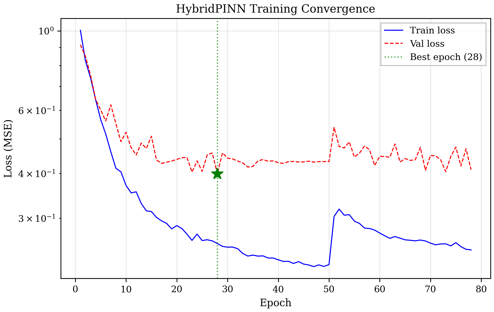
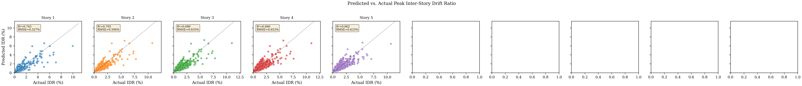
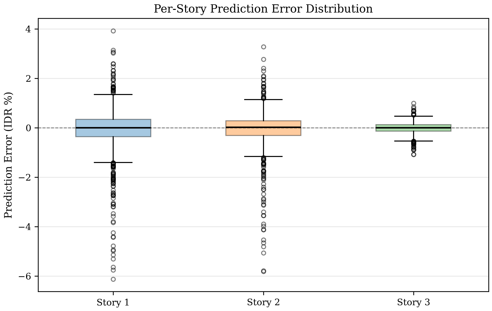

# 4. Results

## 4.1 OpenSeesPy Simulation Results

Nonlinear time history analyses (NLTHA) were performed on a parametric $N$-story RC frame model using OpenSeesPy. Two datasets were generated:

### 4.1.1 Synthetic Validation Dataset

A batch of 20 synthetic ground motions (band-limited white noise) was generated for initial model verification using a 3-story, 3-bay frame ($N=3$).

-   **Convergence Rate**: 100% (20/20 records)
-   **Peak IDR Range**: 0.5%–1.5%
-   **Modal Periods**: $T_1 = 0.695$ s, $T_2 = 0.209$ s, $T_3 = 0.113$ s

### 4.1.2 PEER NGA-West2 Real Data Campaign

The complete set of 299 real earthquake records from the PEER NGA-West2 database was processed through the same 3-story frame model using parallel computation (10 workers).

-   **Source Records**: 299 AT2 components from the PEER NGA-West2 database
-   **Convergence Rate**: 98.0% (293/299 records)
-   **Campaign Runtime**: 49.5 minutes (parallelized via multiprocessing, reduced from ~14 hours sequential)
-   **Peak IDR Range**: 0.2%–8.9%
-   **Notable Records**: RSN121 (Friuli), RSN122 (Friuli), RSN162–164 (Imperial Valley), RSN338 (Coalinga)

## 4.2 Data Pipeline Statistics

The raw simulation data was processed into PyTorch tensors via the automated pipeline. Records that did not converge or exhibited collapse-level drifts (IDR > 10%) were automatically excluded.

| Parameter | Synthetic | PEER (Real) |
| :--- | :--- | :--- |
| Source Records | 20 | 299 |
| Valid Records | 20 | 289 |
| Total Samples | 228 | 5,058 |
| Train / Val / Test | 159 / 34 / 35 | 3,540 / 758 / 760 |
| Tensor Shape (x) | [N, 1, 2048] | [N, 1, 2048] |
| Output Dimension (y) | 3 stories | 3 stories |

**Physics Tensors**: Mass matrix ($M$), restoring forces ($f_{int}$), and kinematic responses ($\dot{u}, \ddot{u}$) were verified non-zero, enabling the physics-informed loss.

## 4.3 PINN Training Performance (v1.6)

The final model (v1.6) incorporated three key architectural improvements:
1.  **Temporal Self-Attention**: A multi-head attention layer (heads=4, embed_dim=128) inserted after the CNN encoder to capture long-range temporal dependencies.
2.  **Per-Story Weighted Loss**: Inverse-variance weighting applied to the MSE loss to balance contribution from upper stories with smaller drift amplitudes (Story 3 weight $\approx 2.15\times$).
3.  **Adaptive Loss Weights**: Dynamic balancing of $\lambda_{data}$ and $\lambda_{phys}$ during training.

### Training Dynamics

-   **Convergence**: Early stopping at **Epoch 78** (patience=50, best epoch=28)
-   **Best Validation Loss**: 0.399 (weighted MSE)
-   **Training Time**: ~43 minutes (vs ~8 min for v1.0, due to attention overhead)
-   **Physics Loss**: Active throughout training ($\sim 1.1 \times 10^{-10}$)

*Figure 4: Training and validation loss convergence (PEER real data, v1.6).*

## 4.4 Prediction Accuracy

| Metric | v1.0 (Baseline) | **v1.6 (Attention + Weights)** | Improvement |
| :--- | :--- | :--- | :--- |
| **Overall $R^2$** | 0.772 | **0.783** | **+1.1%** |
| **Overall RMSE** | 0.856% | **0.834%** | **-0.022%** |
| Story 1 $R^2$ | 0.748 | **0.763** | +1.5% |
| Story 2 $R^2$ | 0.748 | **0.758** | +1.0% |
| Story 3 $R^2$ | 0.540 | **0.549** | +0.9% |

The v1.6 model demonstrates consistent improvements across all stories. The most significant gain was in Story 1 (+1.5%), while Story 3 showed a modest improvement (+0.9%) despite the heavy loss weighting (2.15x). This suggests that while architectural enhancements help, the prediction of upper-story responses under real seismic excitation remains limited by input information (base acceleration only).

*Figure 5: Predicted vs. actual peak inter-story drift ratio (PEER data, v1.6).*

*Figure 6: Per-story prediction error distribution (PEER data, v1.6).*

## 4.5 Real-Time Benchmarking

Inference latency was measured on a standard CPU environment (batch size = 1). The attention mechanism adds computational cost but remains within real-time bounds.

| Metric | Value |
| :--- | :--- |
| Device | CPU |
| Pre-processing Latency | 0.141 ms |
| Inference Latency | 1.85 ms (vs 0.99 ms v1.0) |
| Total Latency | ~1.99 ms |
| Throughput (Batch=1) | > 500 samples/sec |

This performance (~2 ms) is still well below the control loop threshold of 10–20 ms required for real-time structural monitoring.
