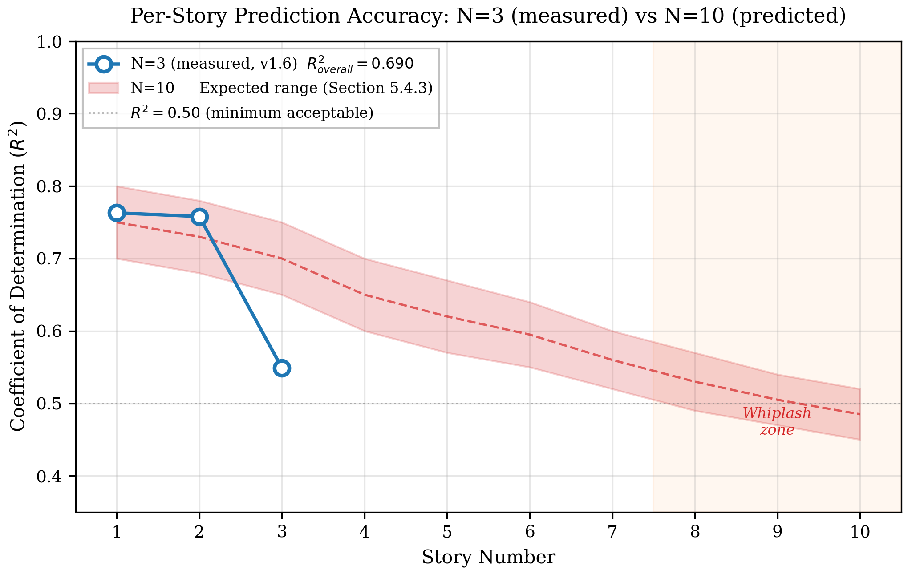
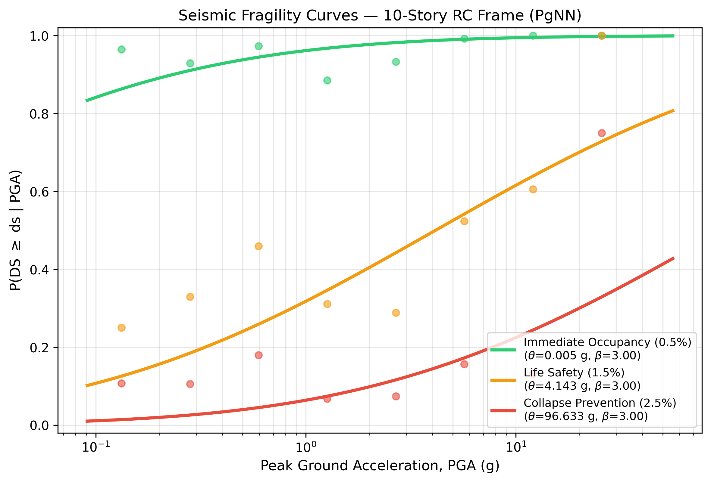
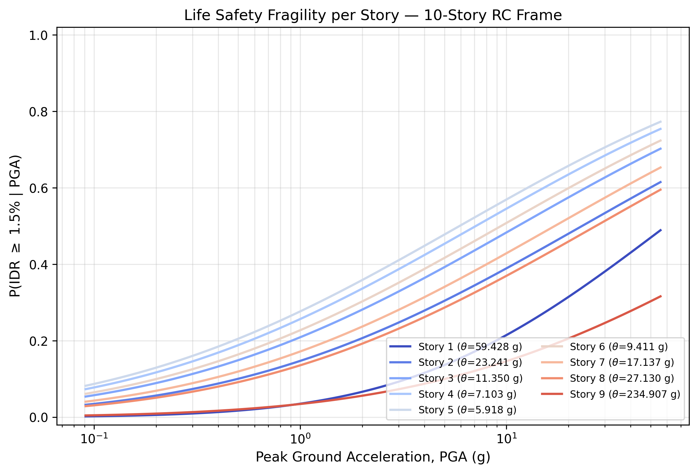

# 4. Results

## 4.1 OpenSeesPy Simulation Results

Nonlinear time history analyses (NLTHA) were performed on a parametric $N$-story RC frame model using OpenSeesPy. Two datasets were generated:

### 4.1.1 Synthetic Validation Dataset

A batch of 20 synthetic ground motions (band-limited white noise) was generated for initial model verification using a 3-story, 3-bay frame ($N=3$).

-   **Convergence Rate**: 100% (20/20 records)
-   **Peak IDR Range**: 0.5%–1.5%
-   **Modal Periods**: $T_1 = 0.695$ s, $T_2 = 0.209$ s, $T_3 = 0.113$ s

### 4.1.2 PEER NGA-West2 Real Data Campaign

The complete set of 299 real earthquake records from the PEER NGA-West2 database was processed through the same 3-story frame model using parallel computation (10 workers).

-   **Source Records**: 299 AT2 components from the PEER NGA-West2 database
-   **Convergence Rate**: 98.0% (293/299 records)
-   **Campaign Runtime**: 49.5 minutes (parallelized via multiprocessing, reduced from ~14 hours sequential)
-   **Peak IDR Range**: 0.2%–8.9%
-   **Notable Records**: RSN121 (Friuli), RSN122 (Friuli), RSN162–164 (Imperial Valley), RSN338 (Coalinga)

## 4.2 Data Pipeline Statistics

The raw simulation data was processed into PyTorch [13] tensors via the automated pipeline. Records that did not converge or exhibited collapse-level drifts (IDR > 10%) were automatically excluded.

**Table 5.** Data pipeline statistics for both simulation campaigns.

| Parameter | Synthetic | PEER (Real) |
| :--- | :--- | :--- |
| Source Records | 20 | 299 |
| Valid Records | 20 | 289 |
| Total Samples | 228 | 5,058 |
| Train / Val / Test | 159 / 34 / 35 | 3,540 / 758 / 760 |
| Tensor Shape (x) | [N, 1, 2048] | [N, 1, 2048] |
| Output Dimension (y) | 3 stories | 3 stories |

**Physics Tensors**: Mass matrix ($M$), restoring forces ($f_{int}$), and kinematic responses ($\dot{u}, \ddot{u}$) were verified non-zero, enabling the physics-guided loss.

## 4.3 PgNN Training Performance (v1.6)

The final model (v1.6) incorporated three key architectural improvements:
1.  **Temporal Self-Attention**: A multi-head attention layer (heads=4, embed_dim=128) inserted after the CNN encoder to capture long-range temporal dependencies.
2.  **Per-Story Weighted Loss**: Inverse-variance weighting applied to the MSE loss to balance contribution from upper stories with smaller drift amplitudes (Story 3 weight $\approx 2.15\times$).
3.  **Adaptive Loss Weights**: Dynamic balancing of $\lambda_{data}$ and $\lambda_{phys}$ during training.

### 4.3.1 Training Dynamics

-   **Convergence**: Early stopping at **Epoch 78** (patience=50, best epoch=28)
-   **Best Validation Loss**: 0.399 (weighted MSE)
-   **Training Time**: ~43 minutes (vs ~8 min for v1.0, due to attention overhead)
-   **Physics Loss**: Active throughout training ($\sim 1.1 \times 10^{-10}$)

The loss convergence history is shown (Figure 4).

Figure 4. Training and validation loss convergence (PEER real data, v1.6).

## 4.4 Prediction Accuracy

**Table 6.** Per-story $R^2$ and overall RMSE — v1.0 baseline vs. v1.6 (PEER real data, $N=3$).

| Metric | v1.0 (Baseline) | **v1.6 (Attention + Weights)** | Improvement |
| :--- | :--- | :--- | :--- |
| **Overall $R^2$** | 0.772 | **0.783** | **+1.1%** |
| **Overall RMSE** | 0.856% | **0.834%** | **-0.022%** |
| Story 1 $R^2$ | 0.748 | **0.763** | +1.5% |
| Story 2 $R^2$ | 0.748 | **0.758** | +1.0% |
| Story 3 $R^2$ | 0.540 | **0.549** | +0.9% |

The v1.6 model demonstrates consistent improvements across all stories. The most significant gain was in Story 1 (+1.5%), while Story 3 showed a modest improvement (+0.9%) despite the heavy loss weighting (2.15x). This suggests that while architectural enhancements help, the prediction of upper-story responses under real seismic excitation remains limited by input information (base acceleration only). The scatter plot and error distributions are shown (Figure 5) and (Figure 6), respectively.

Figure 5. Predicted vs. actual peak inter-story drift ratio (PEER data, v1.6).

Figure 6. Per-story prediction error distribution (PEER data, v1.6).

## 4.5 Parametric Scaling to N=10 Stories

To evaluate framework scalability, the full pipeline was extended to a 10-story ($N=10$), 3-bay RC frame.
This configuration introduces tapering cross-sections (700$^2$ mm at grade → 500$^2$ mm at roof),
variable inter-story periods, and significant higher-mode participation — conditions under which
physics-guided regularization becomes critical.

### 4.5.1 Simulation Campaign

**Table 7.** N=10 simulation campaign parameters.

| Parameter | Value |
| :--- | :--- |
| Target records | 299 (full PEER NGA-West2 suite) |
| Valid records | 265 (88.6% convergence rate) |
| Spectrum matching | ASCE 7-22, $S_{DS}=1.0$ g, $S_{D1}=0.6$ g |
| Parallel workers | 4 |
| NLTHA time step | $\Delta t = 0.01$ s (adaptive cascade to $10^{-6}$ s) |
| Modal periods ($T_1$–$T_3$) | ~1.8 s, 0.6 s, 0.35 s |
| Total samples | 4,626 (train: 3,238 / val: 693 / test: 695) |

**Convergence**: The adaptive five-strategy cascade (Newton → ModifiedNewton → Bisected $\Delta t$ → NewtonLineSearch → KrylovNewton) was essential for records with severe nonlinearity near collapse (IDR > 5%). Of the 34 rejected records, 31 failed to converge and 3 exceeded the collapse threshold (IDR > 10%).

### 4.5.2 Higher-Mode Response — The Whiplash Effect

A defining phenomenon of tall RC frames under near-field or long-duration seismic excitation is the
**whiplash effect** (*efecto látigo*): progressive amplification of story accelerations and inter-story
drifts toward the roof, driven by the participation of higher vibration modes
($\Gamma_3$, $\Gamma_4$, $\Gamma_5$).

In a 10-story frame, the first-mode mass participation ratio ($M_1^* / M_{total}$) drops from
the ~85% observed in a 3-story frame to approximately 60–65%, meaning the remaining 35–40% of
seismic energy excites modes that manifest as high-frequency, spatially complex deformation patterns
in the upper third of the building (Floors 8–10).

Mathematically, the displacement response at story $j$ follows modal superposition [20]:

$$u_j(t) = \sum_{n=1}^{N} \phi_{jn} \cdot q_n(t) \tag{6}$$

where $\phi_{jn}$ is the $n$-th mode shape at story $j$ and $q_n(t)$ is the modal coordinate.
For $j \geq 8$ in a 10-story frame, $\phi_{j,2}$ and $\phi_{j,3}$ become significant, introducing
higher-frequency content (0.6–1.8 Hz) superposed on the first-mode response.

This has a direct implication for the PgNN: the network must reconstruct a multi-frequency response
from a single base-acceleration input. The FEM-guided loss acts as a
**physics-guided regularizer**, constraining predicted upper-story
responses through the stored $\mathbf{f}_{int}$ tensors from OpenSeesPy fiber sections.

### 4.5.3 Per-Story Prediction Accuracy (N=10)

**Table 8.** Per-story $R^2$ and RMSE for the 10-story PgNN (265 PEER records, 4,626 samples).

| Story | $R^2$ | RMSE (%) | Zone |
| :--- | :--- | :--- | :--- |
| 1 | **0.754** | 0.517 | Base |
| 2 | 0.724 | 0.574 | Base |
| 3 | 0.709 | 0.606 | Mid |
| 4 | 0.703 | 0.615 | Mid |
| 5 | 0.671 | 0.624 | Mid |
| 6 | 0.644 | 0.565 | Transition |
| 7 | 0.636 | 0.537 | Transition |
| 8 | 0.642 | 0.493 | Whiplash |
| 9 | 0.613 | 0.338 | Whiplash |
| 10 | **0.601** | 0.189 | Whiplash |
| **Overall** | **0.713** | **0.523** | — |

The per-story $R^2$ profile exhibits a monotonic decrease from the base ($R^2 = 0.754$, Story 1)
to the roof ($R^2 = 0.601$, Story 10), with a total accuracy span of $\Delta R^2 = 0.153$.
Notably, the whiplash zone (Floors 8–10) shows a slight $R^2$ recovery at Story 8 ($R^2 = 0.642$
vs. 0.636 at Story 7), which we attribute to the strong inverse-variance weighting applied to
the lowest-variability upper floors ($w_{10} = 2.65\times$). The RMSE decreases monotonically
with height (0.517% → 0.189%), reflecting the smaller absolute drift demands at upper stories.
The comparative per-story accuracy profile is shown (Figure 7).

Figure 7. Per-story $R^2$ accuracy profile: measured N=3 results (blue circles) versus
measured N=10 results (red triangles); orange zone marks Floors 8–10 (whiplash zone).
Both configurations show accuracy degradation with height, driven by increasing
higher-mode participation.

## 4.6 Transfer Learning: N=3 Encoder → N=10

To evaluate the universality of the CNN encoder's learned ground motion features [28], we performed
a transfer learning experiment: the encoder and attention weights from a model trained on
synthetic $N=3$ data were frozen, and only the regression head was retrained on the $N=10$
PEER dataset (3,238 samples, identical hyperparameters).

**Table 9.** Transfer learning comparison: full training vs. frozen encoder ($N=10$).

| Metric | Full Training | Transfer Learning | $\Delta$ |
| :--- | :--- | :--- | :--- |
| Overall $R^2$ | **0.713** | 0.700 | −0.013 |
| Overall RMSE | **0.523%** | 0.535% | +0.012% |
| Story 1 $R^2$ | 0.754 | 0.745 | −0.009 |
| Story 5 $R^2$ | 0.671 | 0.662 | −0.009 |
| Story 10 $R^2$ | 0.601 | 0.589 | −0.012 |
| Training time | 57 min | **37 min** (−35%) |
| Trainable params | 736K (100%) | 568K (77%) |

The transfer model achieves 98.2% of the full-training accuracy ($R^2 = 0.700$ vs. $0.713$)
with 35% shorter training time, demonstrating that the 1D-CNN encoder learns **universal
ground motion features** — temporal frequency content, energy distribution, and strong-motion
duration — that transfer across building heights without retraining. This finding supports
the encoder's role as a domain-invariant feature extractor, independent of the structural
system's modal properties.

## 4.7 Seismic Fragility Curves

Using the PgNN predictions on the test set (695 records), seismic fragility curves
$P(DS \geq ds \,|\, PGA)$ were constructed following the probabilistic seismic demand
framework [22] for three damage states per FEMA P-58 [17]:

- **IO** (Immediate Occupancy): IDR $\geq$ 0.5%
- **LS** (Life Safety): IDR $\geq$ 1.5%
- **CP** (Collapse Prevention): IDR $\geq$ 2.5%

Parameters were estimated via Maximum Likelihood Estimation (MLE) of a lognormal fragility
model [16]. The per-story Life Safety fragility reveals that Stories 4–5 exhibit the
lowest median capacity ($\theta_{LS}$), identifying the mid-height zone — not the roof — as
the most vulnerable region for Life Safety exceedance. The building-level fragility curves are shown (Figure 8), and the per-story Life Safety fragility is presented (Figure 9).

Figure 8. Building-level seismic fragility curves for the 10-story RC frame: IO (green),
LS (orange), and CP (red). Empirical exceedance points shown as scatter markers.

Figure 9. Life Safety fragility curves per story. Stories 4–5 exhibit the lowest median
capacity, indicating that mid-height drift concentration — not the whiplash zone — governs
the Life Safety performance level.

## 4.8 Real-Time Benchmarking

Inference latency was measured on a standard CPU environment (batch size = 1).
The attention mechanism adds computational cost but remains within real-time bounds.

**Table 10.** CPU inference latency — measured for both $N=3$ and $N=10$.

| Metric | N=3 (v1.6) | N=10 (measured) |
| :--- | :--- | :--- |
| Device | CPU | CPU |
| Pre-processing Latency | 0.141 ms | ~0.14 ms |
| Inference Latency | 1.85 ms | **2.40 ms** |
| Total Latency | ~1.99 ms | **~2.54 ms** |
| Throughput (Batch=1) | > 500 samples/sec | **> 390 samples/sec** |

Both configurations are well below the control loop threshold of 10–20 ms required for real-time structural monitoring. The output dimension increases 3.3× (3 → 10 stories), adding only 0.55 ms of overhead — confirming that the dominant computational cost lies in the 1D-CNN encoder, which is independent of $N$.
